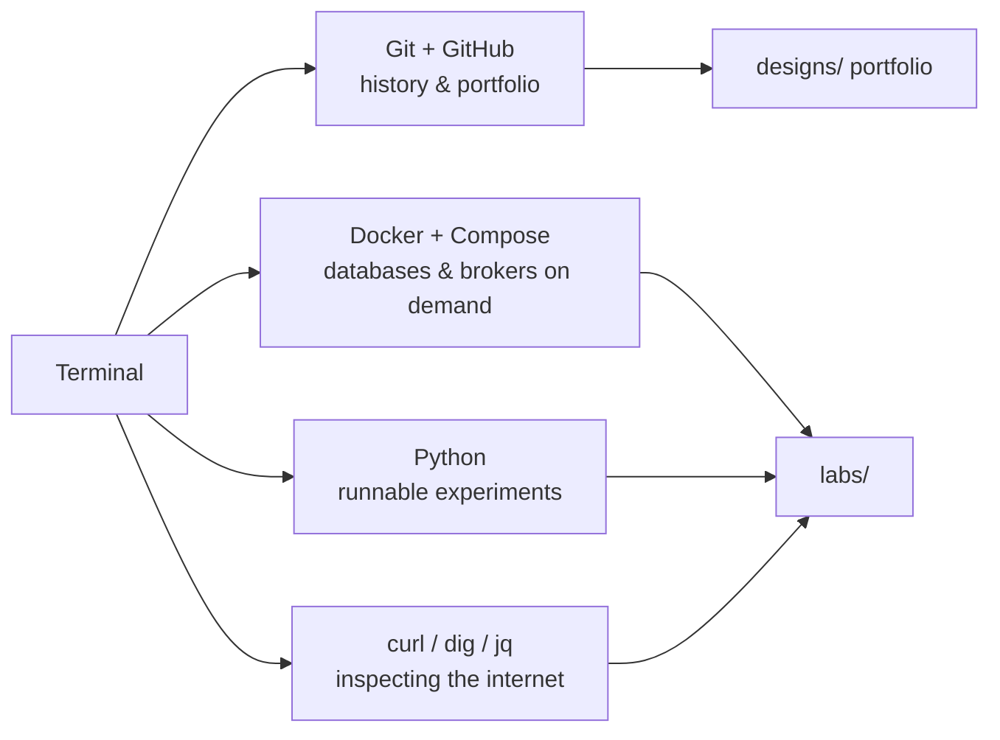

# Chapter 00 Summary — Setup

## What we learned and what got added

One lesson, one goal: a working workshop. You now have (or have the exact commands to get) Git + GitHub verified, Docker Desktop + Compose, Python 3.14, and the three investigators — curl, nslookup (dig's stand-in for now), and jq. The repository gained its permanent structure: `glossary.md`, `toolkit.md` (skeleton), `README.md`, and `troubleshooting.md` were all seeded, and the conventions of the course — Markdown lessons, ASCII + Mermaid diagrams, design docs under `designs/`, labs under `labs/`, a commit after every lesson — are now in force.

## How the pieces connect

Every tool maps to a future need, not a present one:

```
you, in the terminal
        |
        +-- git / GitHub ......... every lesson ends in a commit -> a portfolio grows
        |
        +-- docker / compose ..... Phase 2+: real databases, caches, brokers, one command each
        |
        +-- python ............... labs that let you FEEL latency, hashing, rate limits
        |
        +-- curl / dig / jq ...... Phase 1: dissecting the web request by request
```



Every box above was explained in Lesson 00; the arrows say "this tool feeds that artifact."

## The story so far

Your mental model right now is simple and correct: engineering happens in text, history is kept forever, software travels in containers, and claims get verified by running things. That last one is the spine of the whole course — from Lesson 03 onward, when I state a number, you will often be able to *measure* it.

## Lessons in this chapter

| Lesson | Core idea | Key term/tool |
|---|---|---|
| 00 — Getting Set Up | Build the workshop before the craft; every tool earns its place later | winget, Git, Docker, Python, curl/dig/jq |

## Ideas that come back later

- **Reproducibility** (Docker's promise) returns as pinned image tags in every lab, and as infrastructure-as-code in Lesson 82.
- **Append-only history** (Git's model) returns as write-ahead logs (Lesson 33), replication (Lesson 36), and event sourcing (Lesson 96).
- **Secrets never enter history** returns as the whole of Lesson 91 (secrets management and Vault).
- **DNS**, met today only as "the internet's phone book," gets its full lesson at 07 — with real dig, from a container.

## Self-check

1. Why must you open a *new* terminal after installing a tool?
2. What is the difference between a Docker image and a container?
3. Why is `.gitignore` written *before* the first `git add .`?
4. In PowerShell, why `curl.exe` and not `curl`?
5. What does the pipe `|` do in `curl.exe -s <url> | jq .`?

(All five are answered in Lesson 00 — reread the matching section if any feels shaky.)

## Combining challenge

Using only this chapter's tools: run a container that prints the words `setup complete`, without writing any file. (Hint: Docker Hub has a tiny Linux image called `alpine`, and `docker run` can pass a command to run inside the container.)

<details>
  <summary>Click to reveal the answer</summary>

```powershell
docker run --rm alpine:3.22 echo "setup complete"
```

*Prediction:* Docker reports downloading (`Unable to find image 'alpine:3.22' locally`, then pull progress — first run only), then prints `setup complete`.

What happened, step by step: the Docker engine fetched the `alpine` image (a complete miniature Linux, ~8 MB) from Docker Hub, created an isolated container from it, ran the single command `echo "setup complete"` *inside* that Linux, streamed the output to your terminal, and — thanks to `--rm` — deleted the container. You just ran a program inside a different operating system, on demand, in seconds, and left no trace. That is exactly how every database and broker in this course will arrive. Note the pinned tag `:3.22` rather than bare `alpine` — the reproducibility habit from day one. (If Docker reports a newer Alpine tag exists, any tag works for this challenge.)

</details>

---

*Chapter 00 of Phase 0 — complete. Next: Chapter 01, The System Designer's Mindset.*
