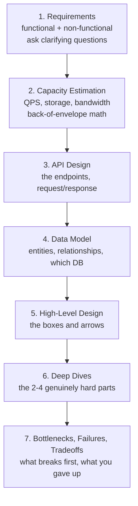

# Lesson 01 — What System Design Is, and Requirements

**Phase 0 — How to Think About Systems · Chapter 01: The System Designer's Mindset · Lesson 01**

- **Covers:** what "designing a system" means; why it is mostly about tradeoffs, not code; functional vs non-functional requirements; the repeatable design framework; clarifying questions
- **Files created:** this lesson; updates to `glossary.md`, `toolkit.md`, `progress-tracker.md`
- **Labs:** none (conceptual lesson)
- **Prerequisites:** Lesson 00 (setup)

---

## SECTION 1 — WHY THIS MATTERS

You can already write code. So here is the uncomfortable truth this lesson starts with: **the hardest part of building a large system is not the code.** It is deciding *what to build*, *how the pieces fit*, and *which painful compromise to accept* — because at scale you can never have everything you want at once.

Imagine someone says: **"Design Twitter."**

A beginner starts typing: a `User` class, a `Tweet` table, a function to post a tweet. Ten minutes in, they are deep in code and have not asked the questions that actually decide the design:

- How many users? 1,000 or 500 million?
- When I post, must my followers see it *instantly*, or is a few seconds' delay fine?
- Do we need it to keep working if an entire data center catches fire?
- Is it worse to briefly show a slightly stale timeline, or to show an error page?

Every one of those answers points to a *different* system. Same three words — "Design Twitter" — but a toy for 1,000 users and the real thing for 500 million share almost no design decisions. **The requirements decide the design. Skip them and you build the wrong thing, beautifully.**

Where this shows up in real systems: every serious engineering project starts with a design document whose first section is requirements. Companies that skip it ship features that collapse under real load or fail to meet a legal/consistency need, and then rebuild from scratch — the most expensive mistake in software.

---

## SECTION 2 — REAL WORLD ANALOGY

**System design is architecture, not bricklaying.**

You would never let a builder pour a foundation before an architect asked: How many people will live here? One family, or 300 apartments? Earthquake zone? What is the budget? Do you need it finished in 3 months or 3 years?

| Building world | Our equivalent | What it decides |
|---|---|---|
| The client's needs | Requirements | What the thing must do and how well |
| The blueprint | The system design (boxes, arrows, data flow) | How the parts fit together |
| Bricks and wood | The code | The actual construction |
| "Must survive an earthquake," "budget \$2M" | Non-functional requirements / constraints | Quietly decide almost everything |

A skyscraper and a cottage both "provide shelter." The difference is entirely in scale and constraints — exactly like software systems. A great architect spends the first meeting *asking questions*, not sketching. So does a great system designer.

---

## SECTION 3 — THE CONCEPT EXPLAINED

### What "designing a system" means

A **system** is a set of parts that work together to do a job — web servers, databases, caches, queues, and the network wires between them. **System design** is deciding *what those parts are, how they connect, and how data flows between them* so the whole thing meets its goals under real-world pressure (lots of users, failing hardware, limited money).

The single most important idea in this whole course:

> **System design is the art of choosing tradeoffs.** Every choice buys you something and costs you something else. There is almost never a "best" answer — only the answer that best fits *this* set of requirements.

A **tradeoff** is when improving one thing forces another thing to get worse. Want faster reads? Add a cache — but now you must deal with stale data. Want to survive a data-center fire? Keep copies in another city — but now those copies can briefly disagree with each other. Naming the cost of every choice, out loud, is what senior engineers do that juniors do not.

### Requirements: functional vs non-functional

Before any design, you write down two kinds of requirements.

**Functional requirements** — *what the system does.* The features. The verbs. If you can phrase it as *"the user can ___,"* it is functional.

For a URL shortener: "Turn a long URL into a short one." "Redirect a short URL to its original." "Show how many times a link was clicked."

**Non-functional requirements** — *how well the system must do it.* Not features — qualities. These are the ones beginners forget, and they are the ones that actually drive the architecture.

The big five to ask about every single time:

| Non-functional requirement | The plain-English question | Why it changes the design |
|---|---|---|
| **Scale** | How many users / requests / how much data? | 1K vs 100M is a completely different machine count and structure. |
| **Latency** | How fast must each response feel? | "Under 100 ms" forces caches and nearby servers; "a few seconds is fine" does not. |
| **Availability** | How much downtime is acceptable? | "Never go down" forces redundant copies of everything — costs money, adds complexity. |
| **Consistency** | Must everyone see the exact same data at the exact same instant? | "Yes, always" (a bank balance) rules out shortcuts that "eventually agrees" (a like count) allows. |
| **Cost** | What is the budget? | Infinite reliability is possible and unaffordable. Budget bounds every choice. |

The three sneaky terms in that table, defined properly since they run through the entire course:

**Latency** is the *delay* between asking for something and getting it — the wait. Think of ordering at a restaurant: latency is how long from placing your order to the plate arriving. Measured in **milliseconds (ms)**, thousandths of a second. Lower is better. (Hard numbers in Lesson 03.)

**Availability** is the *fraction of time the system is up and answering*. We measure it in "nines." **99.9%** ("three nines") sounds nearly perfect, but it means the system is allowed to be down about **8.7 hours per year**. **99.99%** ("four nines") means only about **52 minutes per year**. Each extra nine is roughly 10× less downtime — and much more expensive to achieve. (Full treatment in Lesson 04.)

**Consistency** is whether all copies of the data agree *right now*. If you and I both check a bank balance at the same moment, we must see the identical number — that is **strong consistency**. If we both check a YouTube view count and briefly see 1,002 vs 1,005, nobody is harmed — that is fine to relax. (The deep version, and the famous tradeoff around it, comes in Lesson 39. For now: it is a dial you set per feature.)

How the two requirement types relate:

```
                 REQUIREMENTS
                 /          \
     FUNCTIONAL              NON-FUNCTIONAL
   (what it does)           (how well it does it)
        |                         |
  "shorten a URL"          scale · latency
  "redirect"               availability
  "count clicks"           consistency · cost
        |                         |
  decides the FEATURES     decides the ARCHITECTURE
```

### Clarifying questions: the habit that separates good designs from wrong ones

When given a vague problem ("Design Twitter"), the *first* move is never to design. It is to **ask clarifying questions** until the fog clears. This is the habit interviewers are actually testing, and the one that saves real projects from building the wrong thing for six months.

Good clarifying questions, roughly in order:

1. **Who uses it and to do what?** (Pins down the core features.)
2. **Which features are in scope for *this* design?** (You cannot design all of Twitter in 45 minutes — agree on 2–3 core features.)
3. **How many users / how much traffic?** (Sets the scale.)
4. **Read-heavy or write-heavy?** (Are there far more reads than writes? This single ratio reshapes everything — Lesson 02.)
5. **How fast, how available, how consistent?** (The non-functional dials.)
6. **Any hard constraints?** (Budget, existing tech, legal/data-location rules.)

The point is not to memorize a list. It is the *reflex*: **narrow the problem before solving it.** A designer who asks these looks senior. One who starts drawing boxes immediately looks junior — even if the boxes are good.

---

## SECTION 4 — HOW IT WORKS UNDERNEATH (THE REPEATABLE FRAMEWORK)

Every design problem in this course, and every design interview you will ever face, follows the same skeleton. This is the backbone of every Type-B ("Design X") lesson ahead.



Read top to bottom, it tells a story: *figure out what is needed → size it with numbers → define how clients talk to it → decide how data is stored → sketch the whole thing → solve the hard parts → be honest about what breaks.* Requirements come **first**, and every later step leans on them. That is the whole point of this lesson.

You will not do steps 2–7 yet; you will learn each as its own lesson (estimation is Lesson 02, latency Lesson 03, and so on). What you are locking in *today* is: **it always starts with requirements, and requirements are two lists — what, and how well.**

---

## SECTION 5 — HANDS-ON LAB

This is a **conceptual lesson — no runnable lab.** The "exercise" is a thinking one, and it lives in the challenge in Section 10. From Lesson 03 onward the labs turn hands-on (timing your own machine's memory vs disk), and from Lesson 30 you will start real databases in Docker. Nothing to run today.

---

## SECTION 6 — IN SYSTEM DESIGN

This lesson is the blend's foundation — the lens for every design ahead. Watch how one non-functional answer forces a whole architecture:

- **"Must handle 100M users"** → one server cannot. You need many servers behind a **load balancer** (a traffic director — Lesson 65), and data split across machines (**sharding** — Lesson 37).
- **"Responses under 50 ms"** → you cannot hit the database every time; you add a **cache** (Lesson 42), accepting the staleness tradeoff.
- **"Never lose a posted message"** → you write it to durable storage and maybe a **queue** (Lesson 68) before saying "done," accepting extra latency.
- **"View counts can be a little stale, but the site must never go down"** → you deliberately relax consistency to buy availability (the CAP tradeoff, Lesson 39).

Every one of those is a *requirement* dictating a *structural* choice. Get the requirements wrong and you optimize for the wrong thing — a bank built for eventual consistency, or a chat app engineered for accounting-grade correctness it never needed.

---

## SECTION 7 — GOTCHAS AND COMMON MISTAKES

- **Jumping to a solution before asking questions.** The classic — you design the wrong system confidently. Fix: always spend the first minutes clarifying scope and scale.
- **Ignoring non-functional requirements.** Beginners list features and stop. But "how many users" and "how fast" decide the architecture far more than the feature list. Fix: run the big-five checklist every time.
- **Trying to design everything at once.** "Design Twitter" in full is impossible in one sitting. Fix: agree on 2–3 core features and design those well.
- **Treating a tradeoff as a mistake.** Juniors hunt for the "right" answer and feel bad choosing. Seniors state the tradeoff plainly: "I am caching, so reads are fast but data can be a few seconds stale — acceptable here because it is a view count." Fix: name the cost out loud; that *is* the skill.
- **Vague requirements.** "It should be fast and scalable" is meaningless. Fix: force numbers — *how* fast (ms), *how* many (users/sec).

---

## SECTION 8 — TRADEOFFS AND ALTERNATIVES

The "alternative" to doing requirements is skipping them and coding straight away — which feels faster and is the single most expensive mistake in software. You build something, discover at scale it cannot handle the real load or the real consistency need, and rebuild from scratch.

There is a real tradeoff *within* requirements too: **spend too long gathering them and you never build anything (analysis paralysis); spend too little and you build the wrong thing.** The senior move is enough clarity to start on the parts you are sure of, while flagging the unknowns. In this course, each design lesson does a *focused* requirements pass — sharp enough to design well, not so exhaustive it stalls.

---

## SECTION 9 — KEY TAKEAWAYS

- System design is the craft of choosing tradeoffs — every choice buys one thing at the cost of another, and there is rarely a single "best" answer, only the best fit for the requirements.
- Requirements come in two kinds: **functional** (what the system does — the features) and **non-functional** (how well it does it — scale, latency, availability, consistency, cost).
- Non-functional requirements, not the feature list, are what actually shape the architecture — so always run the big-five checklist.
- Asking clarifying questions to narrow scope and scale *before* designing is the habit that separates senior designers from junior ones.
- Every design problem follows the same skeleton — requirements → estimation → API → data model → high-level design → deep dives → tradeoffs — and it always begins with requirements.

---

## SECTION 10 — CHALLENGE (WITH HIDDEN ANSWER)

**Part A.** Sort each of these into *functional* (F) or *non-functional* (NF):

1. A user can upload a photo.
2. The photo appears in followers' feeds within 5 seconds.
3. The system stays up 99.99% of the time.
4. A user can follow another user.
5. The service must cost under \$10,000/month to run.
6. A user can search photos by hashtag.
7. Two users viewing the same like count may briefly see different numbers.

**Part B.** For a simple **photo-sharing app** (think a tiny Instagram), write down 3 functional requirements and fill in the big-five non-functional requirements with *specific* answers (invent reasonable numbers). Then name one tradeoff your answers force.

<details>
  <summary>Click to reveal the answer</summary>

**Part A**

1. **F** — a feature (the user can upload).
2. **NF** — latency (how fast the feature works).
3. **NF** — availability (how much uptime).
4. **F** — a feature (the user can follow).
5. **NF** — cost.
6. **F** — a feature (the user can search).
7. **NF** — consistency (specifically, this is *relaxed*/eventual consistency being declared acceptable).

Notice the pattern: anything phrased "the user can ___" is functional; anything about *how fast / how much / how reliable / how in-sync / how cheap* is non-functional.

**Part B — one reasonable answer**

*Functional (3):*
- A user can upload a photo with a caption.
- A user can follow other users and see their photos in a feed.
- A user can like a photo.

*Non-functional (big five, with numbers):*
- **Scale:** 10 million users, ~1 million daily active, ~500,000 photo uploads/day, feed views far outnumber uploads (say 100 reads per write).
- **Latency:** feed loads in under 200 ms; upload confirmed in under 1 second.
- **Availability:** 99.9% (about 8.7 hours of downtime/year is tolerable — this is not a bank).
- **Consistency:** relaxed/eventual for like counts and feeds (a few seconds of staleness is fine); the photo itself must never be lost once "upload complete" is shown.
- **Cost:** keep infrastructure under, say, \$50,000/month at this scale.

*One tradeoff these force:* Because reads vastly outnumber writes (100:1) and feeds tolerate a few seconds of staleness, you will **cache feeds and precompute them** to hit the 200 ms target — buying fast reads at the cost of feeds sometimes being a few seconds behind reality. That is the right trade *here* because we explicitly said eventual consistency for feeds is acceptable. In a different app (a stock-trading price feed) that same trade would be unacceptable — same technique, different requirements, opposite decision. That is system design in one sentence.

</details>

---

## SECTION 11 — TOOLKIT UPDATE

Adds the course's first **decision framework** to `toolkit.md`: the 7-step design skeleton, the functional-vs-non-functional split, the big-five non-functional checklist, and the clarifying-questions reflex.

---

## SECTION 12 — WHAT IS NEXT

Lesson 02 — **Back-of-the-envelope estimation**: powers of two, and how to turn "100M users" into real numbers for requests-per-second, storage-per-year, and bandwidth. It is step 2 of the framework, and where the toolkit's numbers really begin.

---

_Lesson 01 of the curriculum · Phase 0 · Chapter 01: The System Designer's Mindset · Lesson 1 of 4 in this chapter._
